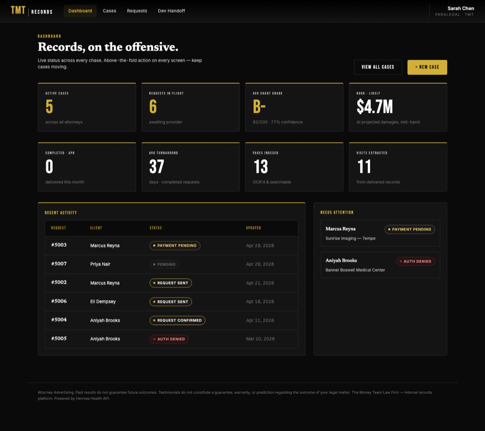
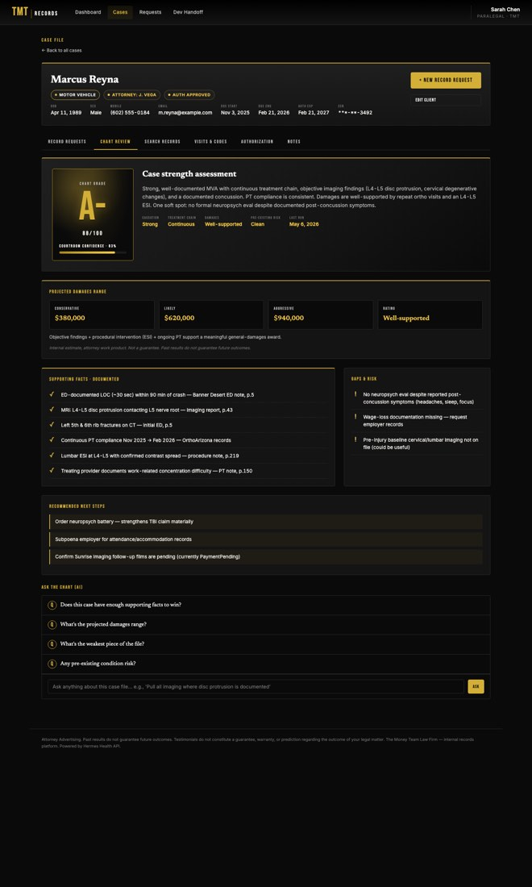
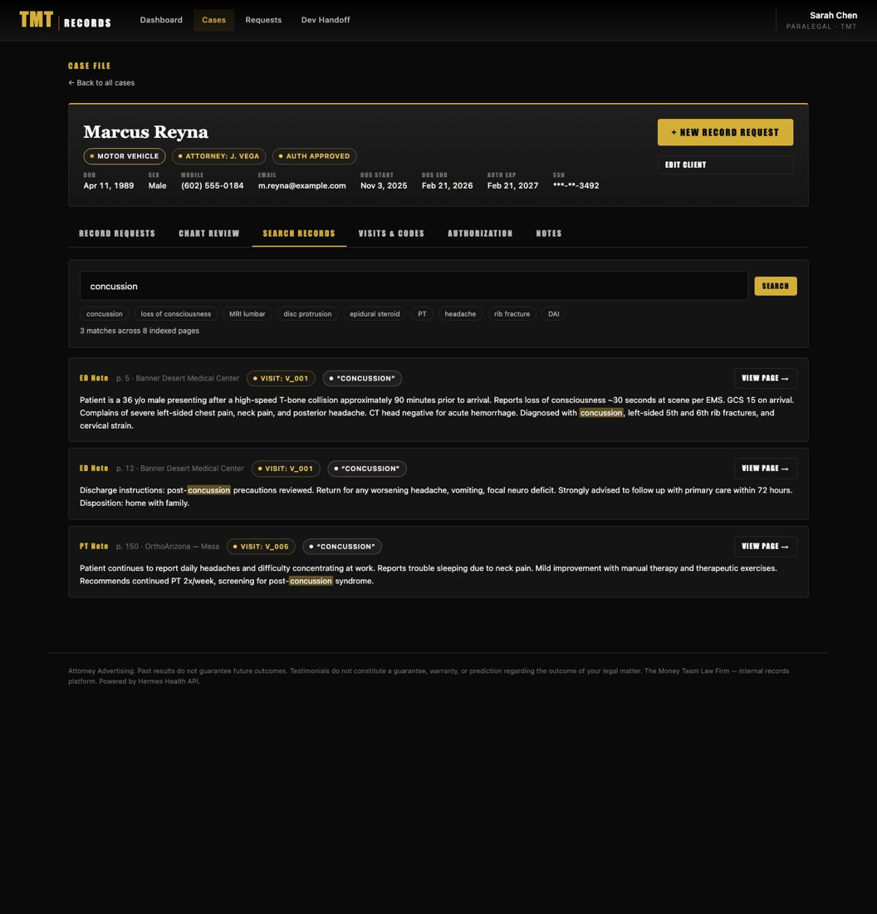
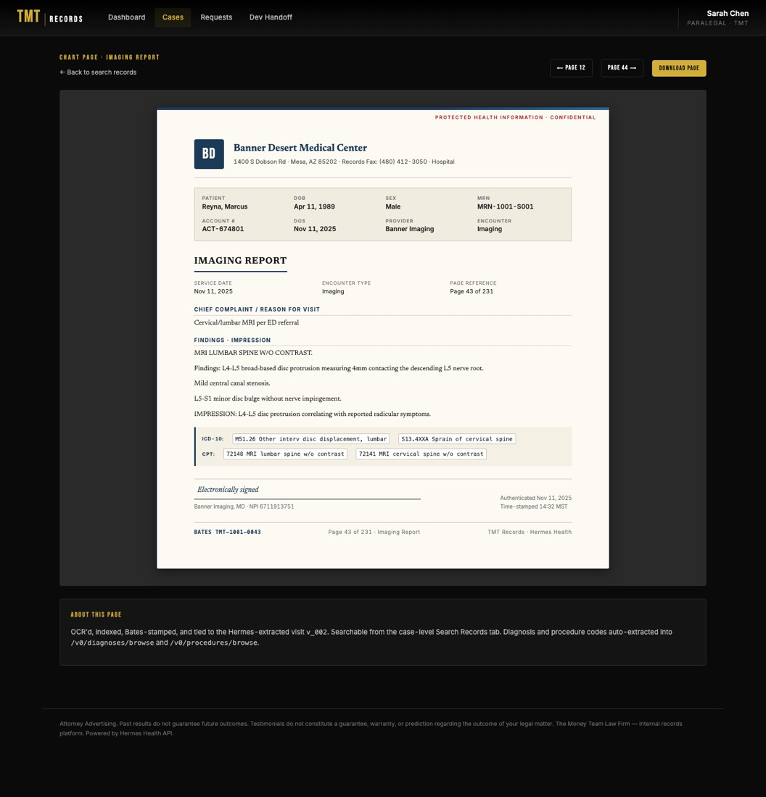

# TMT Records — Medical Record Chase MVP

Attorney-side portal for **The Money Team Law Firm** to submit, track, search, and AI-grade medical record requests through the [Hermes Health](https://hermeshealth.ai) retrieval API.

A clickable, fixture-driven prototype. No backend, no build step, no auth — just open it. Ships ready for development handoff.

## 🔗 Live demo

**→ See the live demo**: *(GitHub Pages URL — flips on automatically once the repo is pushed)*

URL flags you can append to the demo:

| Flag | Effect |
| ---- | ------ |
| `?skipAuth=1` | Bypass the login splash |
| `&tab=N`      | Deep-link a case-detail tab (0=Requests, 1=Chart Review, 2=Search Records, 3=Visits & Codes, 4=Authorization, 5=Notes) |
| `&q=concussion` | Pre-fill the chart-search input |

Example: `?skipAuth=1&tab=1#/cases/pat_1001` opens the AI Chart Review for Marcus Reyna.

## 📸 The flagship screens

|  |  |
| --- | --- |
|  | **Dashboard** — 8-tile scoreboard. Top row blends Hermes status counts with TMT AI rollups (avg chart grade, projected book of damages). |
|  | **Chart Review (AI)** — letter grade, courtroom confidence bar, projected damages range, supporting facts vs gaps, and an "Ask the Chart" Q&A panel. |
|  | **Search Records** — full-text search across every delivered chart with gold-highlighted snippets, page references, and visit linkage. |
|  | **Sample Chart Pages** — every indexed page rendered as a faithful medical-record facsimile: letterhead, PHI banner, ICD/CPT footer, e-sig, Bates stamp. |

## ⚡ Quick start

```bash
git clone https://github.com/jordychase/records-chase-mvp.git
cd records-chase-mvp
python3 serve.py
# open http://localhost:8080
```

Use `serve.py` (not `python3 -m http.server`) — it sends `Cache-Control: no-cache` headers so your edits show up on reload. The bare `http.server` module aggressively caches JS/CSS and you'll see stale UI across builds. If you do hit a stale page, hard-refresh: **Cmd+Shift+R** (macOS) or **Ctrl+Shift+R** (Windows/Linux).

The login form is mock — any input lets you in. State lives in memory; refresh resets the prototype.

## 📁 Files

| File              | Purpose |
| ----------------- | ------- |
| `index.html`      | Shell + Google Fonts (Bebas Neue, Newsreader, Inter) |
| `styles.css`      | Brand tokens + components. Black + gold, red reserved. |
| `fixtures.js`     | Sample data shaped to Hermes schemas — patients, requests, **visits, ICD-10, CPT, OCR'd chart pages, AI chart reviews**. |
| `app.js`          | Hash router + every view. Vanilla JS. |
| `serve.py`        | Tiny no-cache HTTP dev server. |
| `docs/api-map.md` | Text-only mapping of every screen → Hermes endpoint(s). |
| `handoff/build_deck.py`     | Regenerates the standalone HTML handoff deck from screenshots. |
| `handoff/hermes_openapi.json` | Hermes Health public OpenAPI spec snapshot. |

## 🗺️ Information architecture

```
Login                                      #/login
Dashboard (KPI scoreboard + chart grades)  #/
Cases (list)                               #/cases
  └ Case detail                            #/cases/:id
      ├ Record Requests             tab=0
      ├ Chart Review (AI)           tab=1   ← grade, confidence, facts, gaps, Q&A
      ├ Search Records              tab=2   ← keyword search across delivered charts
      ├ Visits & Codes              tab=3   ← extracted timeline, ICD-10, CPT
      ├ Authorization               tab=4   ← AI auth-check
      └ Notes                       tab=5
  └ New case                               #/cases/new
  └ New record request                     #/cases/:id/requests/new
  └ Chart page (rendered medical record)   #/cases/:id/chart/:pageNum
Requests (all)                             #/requests
  └ Request detail                         #/requests/:id   ← timeline + chart contribution
Dev Handoff                                #/handoff
```

## 🎨 Brand foundation (from the deck)

- **Voice** — championship swagger, plain English. *"We win. You get paid."*
- **Color** — 95% Black + Gold. Red reserved (`AuthDenied` / `FacilityRefusal` / `Cancel` only).
- **Type** — Bebas Neue (display + KPI numerals), Newsreader (headings), Inter (body).
- **Operating principles enforced**: (1) action above the fold every screen, (2) attorney-advertising disclaimer in the footer, (3) no gavels/scales/stock handshakes, (4) atoms reused for cohesion at 500+ pages.

## 🔌 Hermes API mapping

Every screen → Hermes endpoint, plus the TMT-built AI layer architecture, is documented in **[docs/api-map.md](docs/api-map.md)** and on the in-app `/handoff` page.

Quick model:

- TMT is a Hermes **company** with `purpose = LegalPlaintiff`.
- Each TMT case = one Hermes **patient** (the injured client).
- Each chase is a **record-request** against a resolved **site** (provider).
- Hermes does the structured extraction: `visits`, `diagnoses` (ICD-10), `procedures` (CPT), `auth-check` analysis.
- TMT layers two capabilities on top: **records search** (page-level OCR index) and **agentic chart review** (LLM grades, facts, damages, Q&A).

## 📦 Handoff artifacts

The full slide deck and screenshot bundle live in [GitHub Releases](https://github.com/jordychase/records-chase-mvp/releases) — not tracked in the repo to keep clones lean.

- `TMT-Records-MVP-Handoff.html` — single-file deck (~3.8 MB), embedded screenshots, works offline
- `screens.zip` — every PNG at 1440px wide

## ❓ What's intentionally not in the MVP

Real Hermes API calls; real auth (SSO/OIDC); document/PDF viewer; webhook → SSE pipeline; bulk CSV import; reports/billing exports; audit-log UI; role-based permissions; production RAG-backed Q&A; production search index (currently substring matching).

These are mapped to phases in [docs/api-map.md](docs/api-map.md) and the in-app handoff page.

## ⚖️ Legal

Internal records platform for The Money Team Law Firm. Powered by Hermes Health API. All patient/case data shown is fictional. Attorney Advertising. Past results do not guarantee future outcomes.
